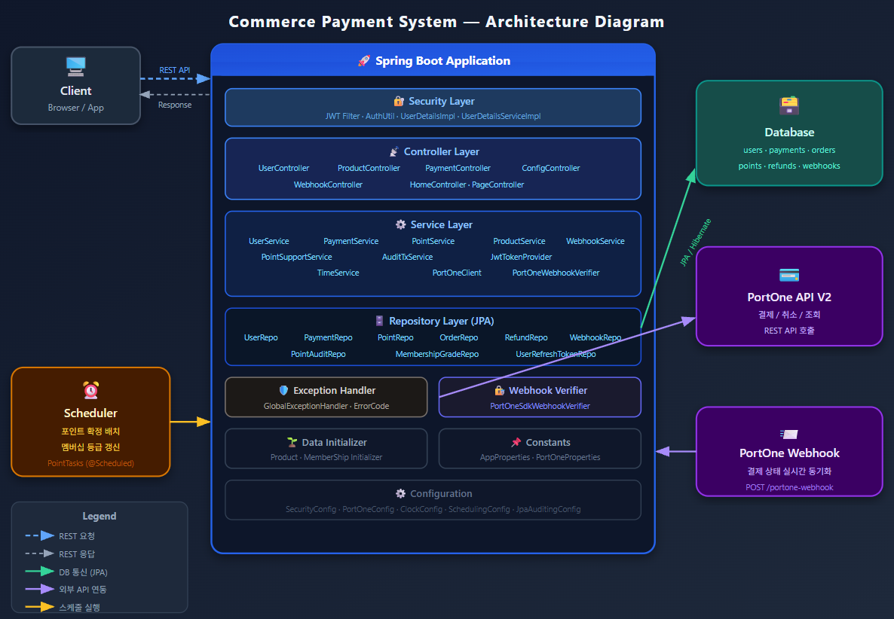

# 🛒 Commerce Payment System

## 📖 목차
1. [프로젝트 소개](#프로젝트-소개)
2. [팀소개](#팀소개)
3. [주요기능](#주요기능)
4. [개발기간](#개발기간)
5. [기술스택](#기술스택)
6. [서비스 구조](#서비스-구조)
7. [API 명세서](#API-명세서)
8. [ERD](#ERD)
9. [프로젝트 파일 구조](#프로젝트-파일-구조)
10. [Trouble Shooting](#trouble-shooting)

---

## 👨‍🏫 프로젝트 소개

**Commerce Payment System**은 실제 커머스 환경을 구현한 결제 통합 플랫폼입니다.

사용자는 상품을 조회하고 주문을 생성한 뒤, PortOne(아임포트) V2 API를 통해 결제를 진행할 수 있습니다.
결제 완료 시 멤버십 등급에 따라 포인트가 자동 적립되며, 적립된 포인트는 이후 결제 시 사용할 수 있습니다.
환불 요청 시 PortOne API를 통해 실제 결제 취소가 이루어지며, 웹훅(Webhook)을 통해 결제 상태를 실시간으로 동기화합니다.

---

## 팀소개

| 이름 | 역할 | Github                                |
|------|------|---------------------------------------|
| 나은총 | 팀장 | https://github.com/popo2381                    |
| 정은식 | 팀원 | https://github.com/S1K1DA        |
| 강동혁 | 팀원 | https://github.com/youzting                            |
| 조성진 | 팀원 | https://github.com/imprity                         |
| 조현희 | 팀원 | https://github.com/hhjo96 |

---


## 💜 주요기능

- **회원 인증**: 이메일 기반 회원가입 및 로그인, JWT Access/Refresh Token 발급, 로그아웃 및 토큰 갱신
- **상품 관리**: 판매 중인 상품 목록 조회 및 상세 조회 (카테고리: 전자기기, 음식, 장난감, 의류)
- **결제 처리**: PortOne V2 API 연동을 통한 결제 시도·확정·실패 처리, 비관적 락을 통한 동시성 제어
- **포인트 시스템**: 멤버십 등급(NORMAL / VIP / VVIP)별 결제 금액 비례 포인트 적립, 결제 시 포인트 사용, 배치 작업을 통한 포인트 확정 처리
- **환불 처리**: 결제 후 7일 이내 환불 요청 시 PortOne API 통해 실제 결제 취소 및 재고 복구
- **웹훅 이벤트**: PortOne Webhook V2 서명 검증(Standard Webhooks), 멱등성 처리, 결제 상태 실시간 동기화

---

## ⏲️ 개발기간
- 2026.02.04(수) ~ 2026.02.20(금)

---

## 📚️ 기술스택

### ✔️ Language


### ✔️ Version Control


### ✔️ IDE


### ✔️ Framework


### ✔️ Deploy


### ✔️ DBMS


---

## 서비스 구조

```
[Client]
   │
   ▼
[Spring Boot Application]
   ├── Security Layer (JWT 인증 필터)
   ├── Controller Layer (REST API)
   ├── Service Layer (비즈니스 로직)
   ├── Repository Layer (JPA)
   └── External API
        └── PortOne V2 (결제 / 환불 / 웹훅)

[Scheduler]
   └── 포인트 확정 & 멤버십 등급 갱신 배치 (Spring Scheduler)
```

---


## API 명세서

| 분류 | Method | URL | 설명 | 인증 |
|------|--------|-----|------|------|
| 인증 | POST | `/api/auth/signup` | 회원가입 | ❌ |
| 인증 | POST | `/api/auth/login` | 로그인 (JWT 발급) | ❌ |
| 인증 | POST | `/api/auth/refresh` | Access Token 재발급 | ❌ |
| 인증 | POST | `/api/auth/logout` | 로그아웃 | ✅ |
| 인증 | GET | `/api/auth/me` | 내 정보 조회 | ✅ |
| 상품 | GET | `/api/products` | 상품 목록 조회 | ❌ |
| 상품 | GET | `/api/products/{productId}` | 상품 상세 조회 | ❌ |
| 결제 | POST | `/api/payments/attempt` | 결제 시도 | ✅ |
| 결제 | POST | `/api/payments/{paymentId}/confirm` | 결제 확정 | ✅ |
| 결제 | POST | `/api/payments/{paymentId}/refund` | 환불 요청 | ✅ |
| 웹훅 | POST | `/portone-webhook` | PortOne 웹훅 수신 | ❌ |
| 설정 | GET | `/api/public/config` | 프론트 런타임 설정 조회 | ❌ |

---

## ERD


---

## 프로젝트 파일 구조

```
src/main/java/com/spartaifive/commercepayment/
├── common/
│   ├── audit/                  # AuditTxService (트랜잭션 분리 감사 서비스)
│   ├── auth/                   # AuthUtil, UserDetailsImpl, UserDetailsServiceImpl
│   ├── config/                 # Security, JWT, PortOne, JPA Auditing, Scheduling 설정
│   ├── constants/              # 환불 기간 등 비즈니스 상수
│   ├── controller/             # ConfigController, HomeController, PageController
│   ├── exception/              # GlobalExceptionHandler, ErrorCode, 커스텀 예외
│   ├── external/
│   │   └── portone/            # PortOneClient, Request/Response DTO
│   ├── initializer/            # 테스트 데이터 초기화 (상품, 멤버십)
│   ├── response/               # 공통 응답 포맷 (DataResponse, MessageResponse 등)
│   ├── security/               # JwtAuthenticationFilter, JwtTokenProvider
│   └── service/                # TimeService
└── domain/
    ├── payment/                # 결제 엔티티, 서비스, 컨트롤러, DTO
    ├── point/                  # 포인트 엔티티, 서비스, 배치 작업
    ├── product/                # 상품 엔티티, 서비스, 컨트롤러
    ├── refund/                 # 환불 엔티티, 레포지토리
    ├── user/                   # 유저, 멤버십, 리프레시 토큰 엔티티 및 서비스
    └── webhookevent/           # 웹훅 엔티티, 서비스, 컨트롤러, 서명 검증기
```

---

## Trouble Shooting


>
> ### 🔴 문제: [문제 제목]
> - **상황**: 어떤 상황에서 발생했는지
> - **원인**: 원인 분석
> - **해결**: 해결 방법

> ### 🔴 문제: 포인트 합을 구하는 SQL문이 에러가 남
> - **상황**: 포인트 적립을 java쪽에서 하는게 아닌 DB쪽에서 할려고 할 때 에러가 났습니다
> - **원인**: sql문에서 `SUM(NULL)`은 0이 아닌 NULL이여서 그랬습니다
> - **해결**: `COALESCE(SUM(pay.actualAmount), 0))`를 사용했습니다

> ### 🔴 문제: 포인트 내역을 업데이트 할 때 deadlock이 걸림
> - **상황**: 포인트 내역을 업데이트 할려고 할 때 어떤이유에서인지 deadlock이 걸렸습니다
> - **원인**: 포인트가 결제에 대해 FK를 가지고 있고 결제 transaction중 `PESSIMISTIC_WRITE`가 걸리기 때문에 새 transaction을 실행할 경우 FK check에 deadlock이 걸렸습니다
> - **해결**: 포인트 내역을 새 transaction에서 생성하지 않고 기존 transaction에 참여하도록 했으며 포인트 내역의 FK를 껐습니다

> ### 🔴 문제: test마다 DB를 갈아업기
> - **상황**: integration test중 transaction rollback만으로는 DB를 초기화 할수 없었습니다
> - **원인**: test할 코드중 새 transaction을 생성하는 코드가 있었기 때문입니다
> - **해결**: 테스트 마다 DB를 reset하는 helper 클래스를 따로 만들었습니다


