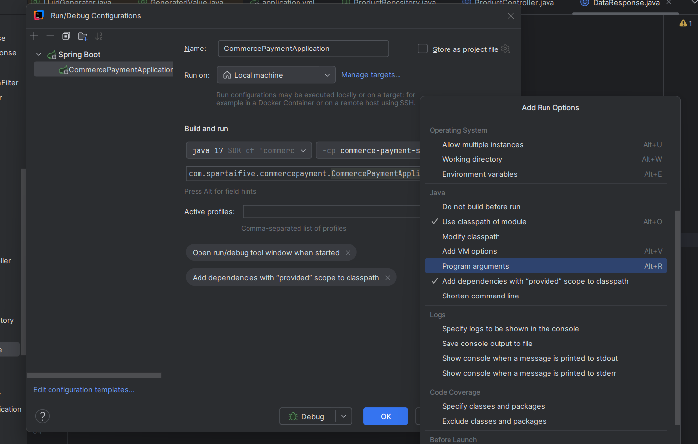
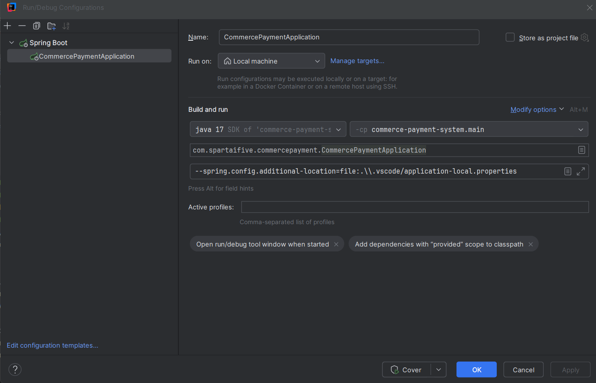

# commerce-payment-system

## 개인 별 설정 파일을 추가하는 방법

개발을 하는 중에 개인별로 다른 설정 파일을 사용해야 하는 경우가 있습니다.

그럴 때는 이 방법을 사용하시면 됩니다.

일단 프로젝트에 설정 파일을 만듭니다. 이름 형식은 application-설정이름.properties 혹은 application-설정이름.yml이면 됩니다.

이때 설정 파일이 git에 추가되지 않도록 주의해 주세요. (저는 .gitignore에서 .vscode 폴더가 추가 되어 있기에 항상 이 폴더 안에 넣습니다)

그리고 설정 파일을 읽고 실행 되도록 argument를 주셔야 합니다.

터미널에서는 다음과 같은 명령어를 사용하시면 됩니다.

### Windows cmd에 경우

```
gradlew bootRun --args="--spring.config.additional-location=file:.\\.vscode/application-local.properties"
```

### linux나 macos, gitbash의 경우
```
$ ./gradlew bootRun --args="--spring.config.additional-location=file:.\\.vscode/application-local.properties"
```

### IntelliJ의 경우




## 개인별 설정 예시

```
# 꼭 여기에 active한 프로필을 적으셔야 합니다!!
#
# 예를 들어 application-cool.properties라고 이름을 지으셨다면
# 
# spring.profiles.active=cool 이라고 적으셔야 합니다.
#
spring.profiles.active=local

# DB 설정
spring.datasource.url=jdbc:mysql://localhost:3306/db_name
spring.datasource.username=user
spring.datasource.password=password

spring.jpa.hibernate.ddl-auto=create
spring.datasource.driver-class-name=com.mysql.cj.jdbc.Driver
spring.jpa.properties.hibernate.dialect=org.hibernate.dialect.MySQLDialect

spring.jpa.show-sql=true
spring.jpa.properties.hibernate.format_sql=true

# 테스트 상품 데이터 추가, 이때 상품이 들어갈 테이블이 필요합니다!
app.add-test-products=true
```
